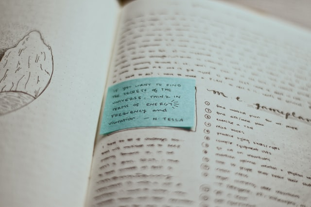

# 這是一個為自己而寫的學習筆記

開宗明義，這是一個寫給自己的學習筆記。

之所謂是寫給自己，就表示所有的內容：第一、不保證正確，第二、不保證更新，第三、不保證實用，所有的文字都只是自己的學習筆記，僅此而已。這種不負責任的三個不保證態度，幾乎等於是保證了這些文字，在不久的將來，註定成為科技世代裡的數位垃圾。

這個網站，就是在有了這樣清楚認識後，而誕生的。

## 那你寫這垃圾是要幹嘛...

這些年來，我因為工作關係，不得不靠著 google 一路摸索，總算也算是自學了一些最基本的程式常識，修修改改一些小專案倒也可以應付工作需要。回過頭來看看這一路的過程，我碰到最大的困難，就是網路上的資訊往往過於破碎化，所有的資訊並不完整且缺乏連貫。雖然網路上優質的文章不算少，但卻往往陷入見樹不見林的無力感，一路上坑坑巴巴摔個狗吃屎是常有的事。想要有系統性的學習，卻又往往啃不下官方文檔，而書籍貴又容易過時。這些各種困難，對初學者來說真的很難克服。

所以我想要解決這個問題嗎? 完全不是! 我不認為我有什麼高見之明可以解決這個痛點。不過我想，既然我沒有辨法改變我在學習路上的 Input，至少我可以把我學得的知識點和邏輯，強迫自己多做一層融會理解，用我自己的語言寫出來，記錄成屬於自己的 Output。

當然，如果你現在在看這篇文章，我衷心希望這些屬於我自己的筆記，也能對你有幫助。

## 為什麼不寫 Blog?

對我而言，Blog 是高手的領域，是我學習的老師，而我並無意寫一些言之無物的文章來誤人子弟。而且 Blog 往往是高手們隨心所欲、隨手寫來，針對某一主題做出自己的見解，但這也是資訊破碎化的來源之一。所以我希望我的筆記，是類似 Documents，有主題有架構，這樣也讓我之後要回頭查看時，更快速的找到我要的資訊。